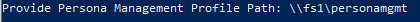
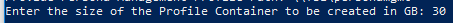
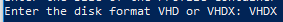
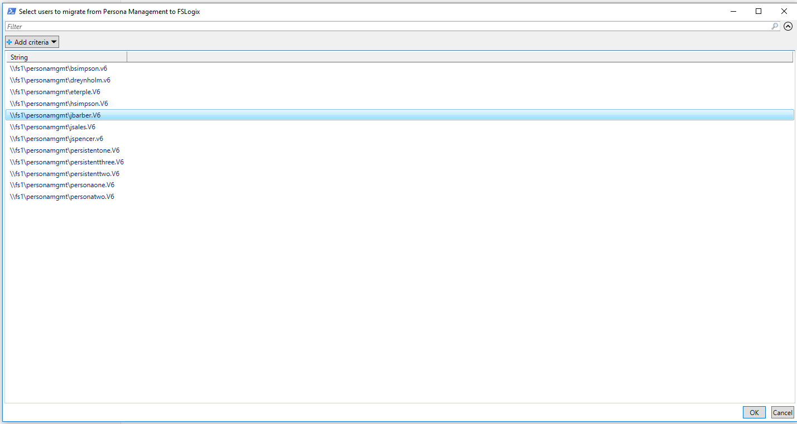
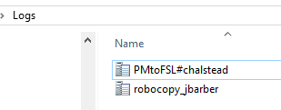
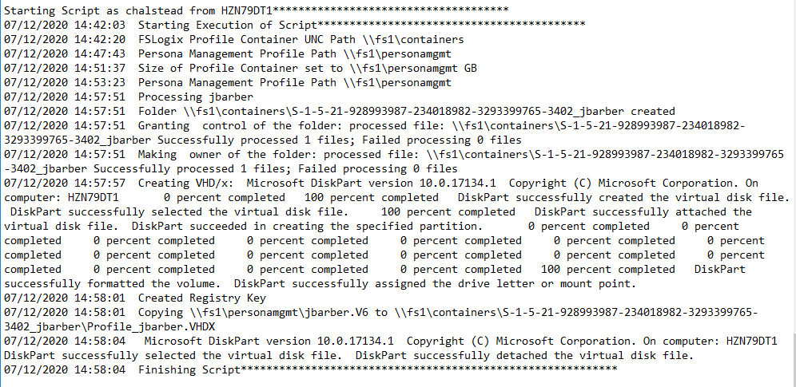
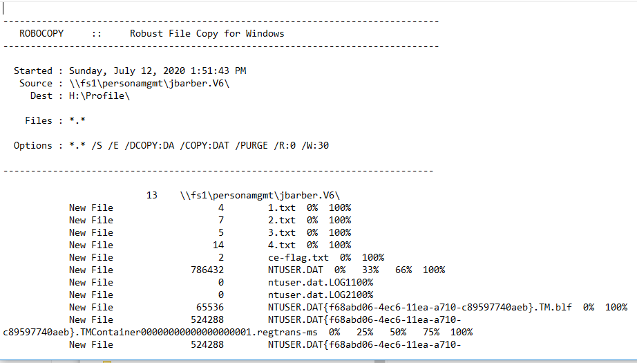

# PersonaManagement-to-FSLogixProfileContainer-Migration
### Overview

Script to Create FSLogix Profile Container and Migrate VMware Horizon Persona Manager Profiles automatically.

The script will look in the Persona Management share for .V6 profiles which can be migrated, it will then display them into a Grid View item.  You can select multiple Persona Management profiles to migrate.  

Once you have chosen the profiles to migrate, the script will then create a VHD/x in the location you specified with all of the requirements of as FSLogix profile container.  The disk will be attached to the local system with a random drive letter (not in use) and required FSLogix folders and a registry entry will be made.  The profile from persona will then be copied to the FSLogix Profile Container and the disk will be detached from the local system.  The Profile Container is now ready for the user and includes data from the Persona Management profile.

### Usage

1. This script needs to be run as an Administrator.  Make sure to launch `WindowsPowerShell (Admin)`
    

2. Run `PM-To-FSL-Migration.ps1`

3. Enter the UNC Path where you want FSLogix Profile Containers Created ex: `Example: \\fileserver\share`
   

4. Enter the UNC Path to the Persona Management Share  `Example: \\fileserver\share`
   

5. Enter the size of the FSLogix Profile Container to be created in Gigabytes `Example: 30`
   

6. Enter the disk format - VHD or VHDX `Example: VHDX`
   

7. Chose one or multiple Persona Management Profiles to migrate and click OK.

   

   *Note: Profiles will not show if the Persona Management Profile contains the `PM2FSLflag.txt` file.  Delete the flag file to run the import process again.*

8. The script will run and do the following:

   1. Create VHD(x) in the specified folder
   2. Set Permissions on the VHD(x)
   3. Attach the VHD(x) to the local system with a random available drive letter
   4. Create directory for FSLogix Profile and set permissions
   5. Create ProfileData.Reg file in the FSLogix Directory
   6. Copy Persona Management Profile data to the FSLogix Profile Directory with robocopy
   7. Create flag file `PM2FSL.txt` indicating that this profile has been migrated
   8. Remove drive letter and detach VHD
   9. Repeat for every selected Persona Management Profiles

### Logging

There is a folder `\Logs` created under the location where the script is executed from

In the logs folder the following logs are created:

- `PMtoFSL#{username who execute script}` - shows details on processing each user.
- `robocopy_{user that was migrated}` - detailed logging of the robocopy from Persona to FSLogix per user

Example of Admin Log:

Example of Robocopy Log:

